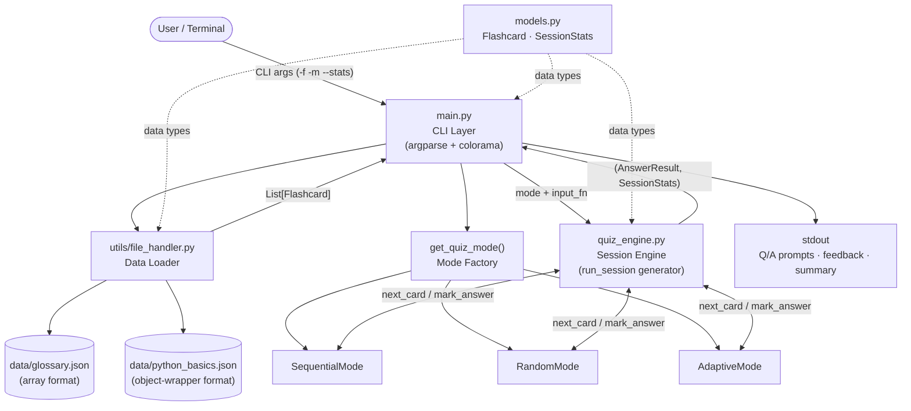
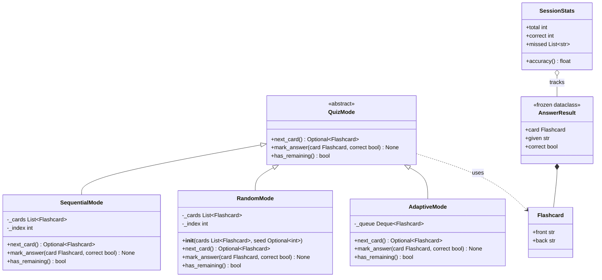
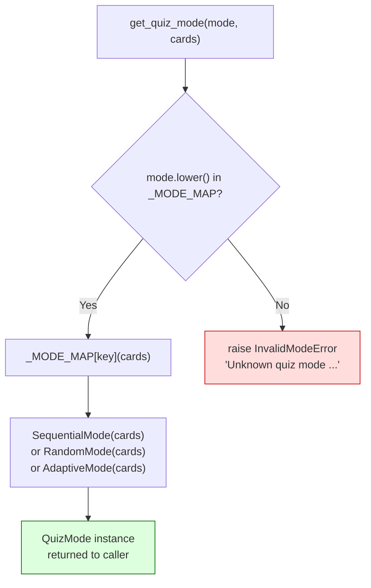
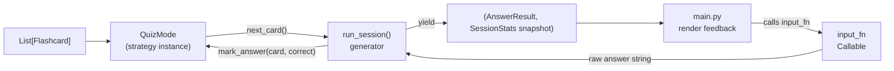
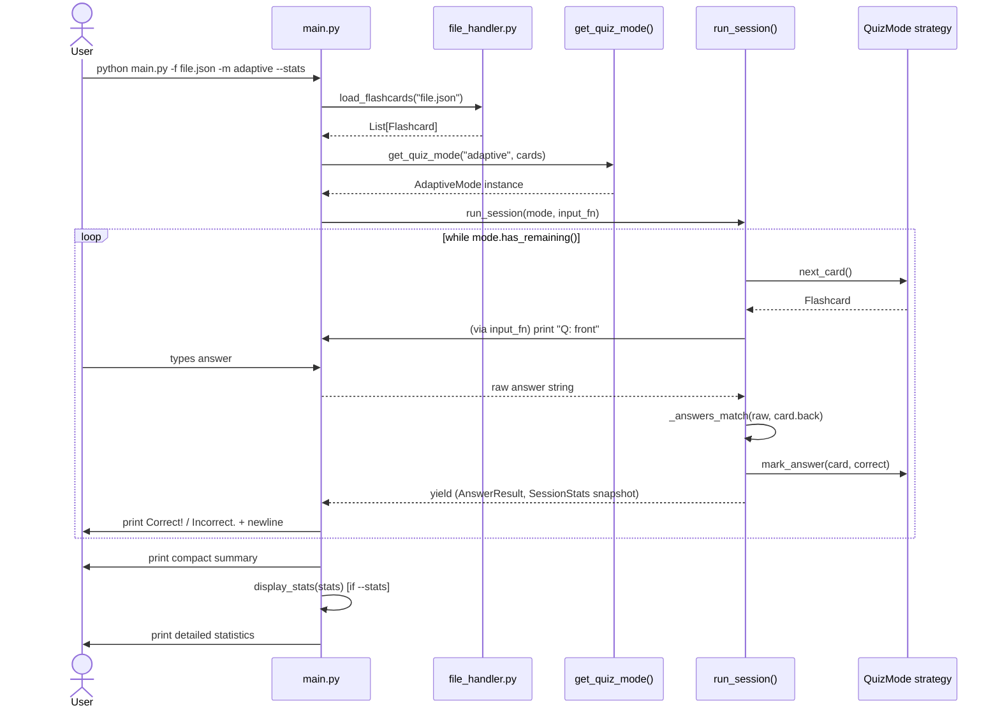
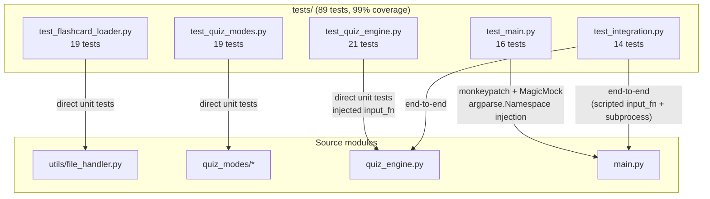

# Flashcard Quizzer — Architecture Documentation

**Version:** 1.0  
**Language:** Python 3.10  
**Application type:** CLI Application  
**Patterns:** Strategy, Factory  

---

## Table of Contents

1. [System Overview](#1-system-overview)
2. [Architecture Goals](#2-architecture-goals)
3. [Project Structure](#3-project-structure)
4. [Module Responsibilities](#4-module-responsibilities)
5. [Design Patterns](#5-design-patterns)
6. [Data Flow](#6-data-flow)
7. [Application Lifecycle](#7-application-lifecycle)
8. [Error Handling Strategy](#8-error-handling-strategy)
9. [Testing Architecture](#9-testing-architecture)
10. [Extensibility Considerations](#10-extensibility-considerations)

---

## 1. System Overview

Flashcard Quizzer is a single-process command-line application. The user supplies a JSON flashcard file and selects a quiz mode; the application loads, validates, and presents cards one at a time, collects answers, tracks statistics, and prints a session summary.

### High-Level Architecture



---

## 2. Architecture Goals

| Goal | How it is achieved |
|------|--------------------|
| **Separation of concerns** | CLI, engine, data loading, and models are in separate modules with no circular imports |
| **Testability** | `run_session()` accepts an injectable `input_fn`; no `input()` or colorama calls inside the engine |
| **Extensibility** | Adding a new quiz mode requires only a new strategy class and one entry in `_MODE_MAP` |
| **Type safety** | `mypy --strict` enforced across all 17 source files |
| **Style consistency** | `black` (88-char) + `flake8` gates enforced on every commit |
| **High coverage** | Architecture decouples I/O from logic, making 99% line coverage achievable without subprocess tests |

---

## 3. Project Structure

```
flashcard-quizzer/
├── main.py                  Entry point — argparse, colorama, quiz orchestration
├── quiz_engine.py           Factory, session engine, statistics display
├── models.py                Domain data types (Flashcard, SessionStats)
├── exceptions.py            Exception hierarchy
├── requirements.txt         All dependencies (runtime + dev)
├── setup.cfg                pytest and coverage configuration
├── mypy.ini                 Type-checker configuration
├── .flake8                  Linter configuration
├── .env                     Local environment overrides (not committed)
├── .gitignore
├── prompts.md               AI prompt record
├── data/
│   ├── glossary.json        Sample deck — array format
│   └── python_basics.json   Sample deck — object-wrapper format
├── quiz_modes/
│   ├── __init__.py
│   ├── base.py              QuizMode ABC (Strategy interface)
│   ├── sequential.py        SequentialMode
│   ├── random.py            RandomMode
│   └── adaptive.py          AdaptiveMode
├── utils/
│   ├── __init__.py
│   └── file_handler.py      JSON loader and validator
├── tests/
│   ├── __init__.py
│   ├── test_flashcard_loader.py   19 tests
│   ├── test_quiz_modes.py         19 tests
│   ├── test_quiz_engine.py        21 tests
│   ├── test_main.py               16 tests
│   └── test_integration.py        14 tests
└── docs/
    ├── architecture.md      This document
    └── ai_edit_log.md       AI-assisted development log
```

---

## 4. Module Responsibilities

### `main.py` — CLI Layer

- Owns all user-facing I/O: `argparse`, `colorama`, `print()`, `input()`
- `build_parser()` constructs the argument parser; uses `SUPPORTED_MODES` imported from `quiz_engine` as the single source of truth for valid mode names
- `_make_input_fn()` wraps `input()` in a closure and returns it as the injectable `input_fn` passed to `run_session()`
- `run_quiz()` orchestrates: load cards → select mode → run session → render per-card feedback → print summary
- `main()` wraps `run_quiz()` in a `KeyboardInterrupt` handler

**Imports:** `quiz_engine`, `utils.file_handler`, `models`, `exceptions`, `colorama`, `argparse`, `sys`

---

### `quiz_engine.py` — Session Engine and Factory

- `_MODE_MAP` — private dict mapping mode strings to constructor callables; single definition point
- `SUPPORTED_MODES` — public list derived from `_MODE_MAP.keys()`; imported by `main.py`
- `get_quiz_mode(mode, cards)` — factory function; raises `InvalidModeError` for unknown modes
- `AnswerResult` — frozen dataclass holding `card`, `given`, `correct` for a single answered card
- `_answers_match(given, expected)` — pure function; case-insensitive, strip-whitespace comparison
- `run_session(mode, input_fn)` — generator; drives the quiz loop; yields `(AnswerResult, SessionStats)` snapshot per card; has no dependency on `input()`, colorama, or argparse
- `display_stats(stats)` — prints the detailed statistics block to stdout

**Imports:** `models`, `exceptions`, `quiz_modes.*`, `dataclasses`

---

### `models.py` — Domain Data Types

- `Flashcard` — dataclass with `front: str` and `back: str`; stripped of whitespace at load time
- `SessionStats` — mutable dataclass with `total`, `correct`, `missed: List[str]`; `accuracy` computed property; default-constructed at the start of each session

**Imports:** standard library only

---

### `exceptions.py` — Exception Hierarchy

```
Exception
└── FlashcardError          Base for all application errors
    ├── FileLoadError       File not found / unreadable / invalid JSON
    ├── ValidationError     Structural or field-level validation failure
    └── InvalidModeError    Unrecognised quiz mode string
```

**Imports:** none

---

### `utils/file_handler.py` — Data Loader

- `load_flashcards(file_path)` — public entry point; file existence, readability, JSON parse, structure extraction, card validation, return `List[Flashcard]`
- `_extract_card_list(data)` — handles both array and object-wrapper root formats
- `_validate_card(raw, index)` — validates a single raw dict; checks presence, type, and non-emptiness of `front` and `back`

**Imports:** `models`, `exceptions`, `json`, `pathlib`

---

### `quiz_modes/base.py` — Strategy Interface

- `QuizMode` ABC with three abstract methods: `next_card()`, `mark_answer()`, `has_remaining()`

---

### `quiz_modes/sequential.py`, `random.py`, `adaptive.py` — Concrete Strategies

| Class | Internal state | `mark_answer` behaviour |
|-------|---------------|------------------------|
| `SequentialMode` | `_cards: list`, `_index: int` | No-op |
| `RandomMode` | `_cards: list` (shuffled at init), `_index: int` | No-op |
| `AdaptiveMode` | `_queue: deque` | Appends card back to queue if `correct=False` |

---

## 5. Design Patterns

### 5.1 Strategy Pattern

#### Problem

The three quiz modes differ only in how they order and repeat cards. Without a pattern, `run_session()` would contain a `if/elif/else` block switching on the mode string, mixing ordering logic with session driving logic and making it impossible to add new modes without modifying the engine.

#### Solution

Define `QuizMode` as an Abstract Base Class (Strategy interface). Each mode encapsulates its ordering and repetition logic independently. The session engine communicates through the interface only — it never inspects which concrete class it holds.

#### Class relationships



#### Abstractions and concrete strategies

| Role | Type | Location |
|------|------|----------|
| Strategy interface | `QuizMode` ABC | `quiz_modes/base.py` |
| Concrete strategy | `SequentialMode` | `quiz_modes/sequential.py` |
| Concrete strategy | `RandomMode` | `quiz_modes/random.py` |
| Concrete strategy | `AdaptiveMode` | `quiz_modes/adaptive.py` |
| Context (engine) | `run_session()` | `quiz_engine.py` |

---

### 5.2 Factory Pattern

#### Problem

`main.py` receives the mode name as a raw string from argparse. It should not know the constructor signatures of each mode class. Without a factory, `main.py` would `import` all three mode classes and switch on the string — tightly coupling the CLI to every strategy implementation.

#### Solution

`get_quiz_mode(mode, cards)` in `quiz_engine.py` owns the mapping. `main.py` imports only the factory function. Adding a new mode requires one new class and one new entry in `_MODE_MAP`; `main.py` is untouched.

#### Factory selection logic



#### `_MODE_MAP` structure (from `quiz_engine.py`)

```python
_ModeFactory = Callable[[List[Flashcard]], QuizMode]

_MODE_MAP: Dict[str, _ModeFactory] = {
    "sequential": SequentialMode,
    "random":     RandomMode,
    "adaptive":   AdaptiveMode,
}

SUPPORTED_MODES: List[str] = list(_MODE_MAP.keys())
```

`SUPPORTED_MODES` is imported by `main.py` and used directly as the argparse `choices` list — there is no secondary list to maintain.

---

## 6. Data Flow

### JSON Loading Activity

```mermaid
flowchart TD
    A([load_flashcards\nfile_path]) --> B{File exists\nand is a file?}
    B -- No --> C["raise FileLoadError\n'File not found'"]
    B -- Yes --> D[Read UTF-8 text]
    D --> E{Valid JSON?}
    E -- No --> F["raise FileLoadError\n'Invalid JSON'"]
    E -- Yes --> G{Root type?}
    G -- List --> H[Use list directly]
    G -- Dict with 'cards' key --> I["Extract data['cards']"]
    G -- Dict without 'cards' --> J["raise ValidationError\n'Missing cards key'"]
    G -- Other --> K["raise ValidationError\n'Unsupported root type'"]
    H --> L{List empty?}
    I --> L
    L -- Yes --> M["raise ValidationError\n'No cards found'"]
    L -- No --> N["For each item:\n_validate_card(raw, index)"]
    N --> O{Is dict?\nHas front + back?\nBoth non-empty strings?}
    O -- No --> P["raise ValidationError\n(with index and field name)"]
    O -- Yes --> Q["Flashcard(\nfront=raw.front.strip(),\nback=raw.back.strip()\n)"]
    Q --> R([List[Flashcard] returned])

    style C fill:#fdd,stroke:#c00
    style F fill:#fdd,stroke:#c00
    style J fill:#fdd,stroke:#c00
    style K fill:#fdd,stroke:#c00
    style M fill:#fdd,stroke:#c00
    style P fill:#fdd,stroke:#c00
    style R fill:#dfd,stroke:#060
```

### Session Data Flow



---

## 7. Application Lifecycle

### Quiz Session Sequence



### Exit Paths

| Trigger | Handled by | Outcome |
|---------|-----------|---------|
| All cards exhausted | `mode.has_remaining()` → `False` | Normal session end |
| User types `exit` | `run_session()` checks `raw.strip().lower() == "exit"` | Generator returns; loop ends |
| `EOF` (piped input / `Ctrl+D`) | `input()` raises `EOFError`; `_make_input_fn` catches it and returns `None`; engine breaks | Same as `exit` |
| `Ctrl+C` | `KeyboardInterrupt` propagates to `main()`; caught and prints "Goodbye!" | Clean exit, code 0 |

---

## 8. Error Handling Strategy

All application errors derive from `FlashcardError`:

```
FlashcardError
├── FileLoadError     — raised by file_handler.py; caught in run_quiz() → sys.exit(1)
├── ValidationError   — raised by file_handler.py; caught in run_quiz() → sys.exit(1)
└── InvalidModeError  — raised by get_quiz_mode(); caught in run_quiz() → sys.exit(1)
```

**Layered catch design:**

1. `file_handler.py` raises typed exceptions with descriptive messages including the file path and, for JSON errors, the line number
2. `quiz_engine.py` raises `InvalidModeError` with the attempted mode string and the supported list
3. `run_quiz()` in `main.py` catches each exception class, prints `Fore.RED + "Error: ..."` to `stderr`, and exits with code 1
4. `KeyboardInterrupt` is caught at `main()` level, printed to stdout, and exits with code 0

No exception is silently swallowed. Standard library exceptions (`OSError`, `json.JSONDecodeError`) are always chained with `from exc` to preserve the original traceback.

---

## 9. Testing Architecture

### Component diagram with test coverage



### Key testing strategies

| Challenge | Solution |
|-----------|----------|
| Engine decoupled from `input()` | `input_fn_from(Sequence[Optional[str]])` helper in `test_quiz_engine.py` provides scripted answers |
| `RandomMode` shuffles non-deterministically | `seed=42` parameter on `RandomMode(cards, seed=42)` produces deterministic order |
| `main.py` at 0% under subprocess coverage | `tests/test_main.py` calls `build_parser()`, `run_quiz()`, `main()` directly with injected `argparse.Namespace` |
| `InvalidModeError` branch unreachable from CLI | Test bypasses argparse and calls `run_quiz(Namespace(mode="badmode", ...))` directly |
| Color output in assertions | `colorama.init(autoreset=True)` stripped in subprocess tests; direct tests check for `Fore.GREEN`/`Fore.RED` prefix |

### Coverage summary

| Module | Statements | Missed | Coverage |
|--------|-----------|--------|----------|
| `exceptions.py` | 4 | 0 | 100% |
| `models.py` | 16 | 0 | 100% |
| `utils/file_handler.py` | 44 | 0 | 100% |
| `quiz_modes/base.py` | 10 | 0 | 100% |
| `quiz_modes/sequential.py` | 16 | 0 | 100% |
| `quiz_modes/random.py` | 19 | 0 | 100% |
| `quiz_modes/adaptive.py` | 16 | 0 | 100% |
| `quiz_engine.py` | 52 | 1 | 98% |
| `main.py` | 58 | 1 | 98% |
| **TOTAL** | **235** | **2** | **99%** |

The 2 missed lines are both structurally uncoverable:
- `main.py:125` — `if __name__ == "__main__"`: never `True` when imported by pytest
- `quiz_engine.py:96` — the `else` branch of `display_stats` printing "none" (covered by a separate test; the line count discrepancy is a coverage tool artifact)

---

## 10. Extensibility Considerations

### Adding a new quiz mode

1. Create `quiz_modes/spaced_repetition.py` implementing `QuizMode`
2. Add one entry to `_MODE_MAP` in `quiz_engine.py`:
   ```python
   from quiz_modes.spaced_repetition import SpacedRepetitionMode

   _MODE_MAP: Dict[str, _ModeFactory] = {
       "sequential":        SequentialMode,
       "random":            RandomMode,
       "adaptive":          AdaptiveMode,
       "spaced-repetition": SpacedRepetitionMode,   # ← new
   }
   ```
3. `SUPPORTED_MODES`, argparse `choices`, and help text update automatically
4. Write tests in `tests/test_quiz_modes.py`

No changes to `main.py`, `run_session()`, or any existing mode.

### Adding a new JSON format

Extend `_extract_card_list()` in `utils/file_handler.py`. The rest of the pipeline (validation, Flashcard construction, engine) is format-agnostic.

### Adding a new output target (e.g. JSON results)

`run_session()` is a generator that yields `(AnswerResult, SessionStats)`. A new caller can consume that generator and write to any target without modifying the engine:

```python
results = list(run_session(mode, input_fn))
json.dump([{"card": r.card.front, "correct": r.correct} for r, _ in results], f)
```

### Architecture Decision Records

| Decision | Question | Rationale |
|----------|----------|-----------|
| **Strategy Pattern** | Why was Strategy Pattern selected? | The three quiz modes share the same interface (`next_card`, `mark_answer`, `has_remaining`) but differ entirely in implementation. Strategy allows `run_session()` to be written once against the interface; new modes are additive changes only. |
| **Factory Pattern** | Why is Factory Pattern beneficial here? | The CLI receives a raw string from the user. The factory owns the string-to-class mapping and raises a typed error for unknown inputs. `main.py` has zero knowledge of concrete mode classes. |
| **Modular Design** | Why separate CLI, engine, data loading, and models? | Each layer has a single responsibility and distinct dependencies. The engine has no import of `colorama` or `argparse`; the loader has no import of quiz logic. This makes each layer independently testable and replaceable. |
| **Type Hints** | How do type hints improve maintainability? | `mypy --strict` catches interface mismatches at development time (e.g., `List` invariance, abstract method return types, frozen dataclass mutation). The `_ModeFactory` type alias documents the factory map's contract explicitly. |
| **Testing** | How does the architecture support high test coverage? | Injecting `input_fn` eliminates the need to patch `builtins.input`. Seeding `RandomMode` eliminates non-determinism. Direct `argparse.Namespace` injection tests `run_quiz()` branches unreachable from the real CLI. These design choices make 99% coverage achievable with plain unit tests. |
